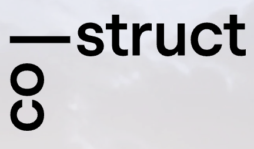

# co-struct Website

<a href="https://co-struct.ch">
  
</a>

### Development

1. Install the php packages defined in composer.json
```bash
    composer install
```
2. Install the node packages defined in package.json
```bash
    npm install
```
3. Start the dev server
```bash
    npm run dev
```
4. Open `localhost:8888` in the browser.

### Preview

To preview the built project run:
```bash
  npm run preview
```

### Build

To build the project run:
```bash
  npm run build
```

### Production
*Being worked on...*

### Folder structure
```bash
.
├── content # The main content of the CMS.
├── kirby # Installed files, can be ignored.
│
├── public # The outward facing folder 
│   ├── dist # vite build generates this with js and css.
│   ├── index.php # First PHP file.
│   └── media # kirby generates images from the content here.
│
├── site # Most of the kirby files
│   ├── blueprints 
│   ├── config
│   ├── plugins
│   ├── snippets
│   └── templates 
│
├── src
│   ├── assets
│   │   └──  # Fonts live here.
│   ├── index.css # Main css file.
│   └── index.js # Main js file.
│
├── storage # Files that we dont need to touch :)
│   ├── accounts
│   ├── cache
│   └── sessions
│
├── server.php # Start of the Kirby PHP Server.
│
├── postcss.config.js # Helps with support for multiple browsers and tailwind.
├── tailwind.config.js # Tailwind config.
├── vite.config.js # Vite config.
├── .dev # File generated from vite.
│
├── vendor  #Where composer stores packages.
├── composer.json # PHP package manager.
├── composer.lock # PHP package manager. No touchy.
│
├── node_modules # Where Node stores packages.
├── package.json # Node package manager.
├── package-lock.json # Node package manager. No touchy.
│
├── .gitignore # Tells git what files to ignore. 
└── README.md
```

Martina Holenstein & Guido Offermans, 2023
